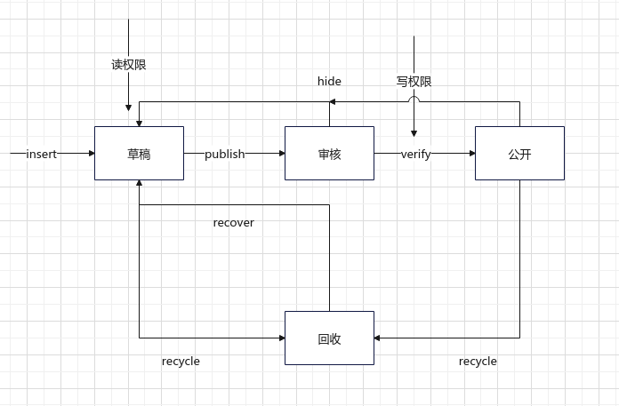
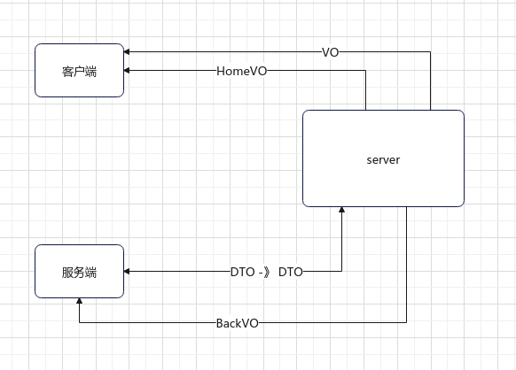

## 类
### 书写顺序：

1. id
2. 外部id
3. 自身属性
4. 状态
5. 权限
6. 时间


## 服务
### 书写顺序

1. 查
2. 更
3. 增
4. 删


## 接口
### 参数

1. param不写@， 其他都写
2. 所有属性都要求默认值


## docker

+ docker run -itd --name redis -p 6379:6379 redis --requirepass "124609"

+ docker run -d --name mongo-shard -p 27017:27017 mongo --auth  mongod --port 27017 --replSet rs0 --bind_ip_all

+ docker run -itd --name rabbitmq -p 15672:15672 -p 5672:5672 -e RABBITMQ_DEFAULT_USER=admin -e RABBITMQ_DEFAULT_PASS=124609 rabbitmq:management

+ docker run -d --name es -p 9200:9200 -p 9300:9300 -e "discovery.type=single-node" -e "xpack.security.enabled=false" docker.elastic.co/elasticsearch/elasticsearch:8.8.1

+ docker run -d --name kibana -p 5601:5601 -e "ELASTICSEARCH_URL=http://localhost:9200" -e "XPACK_MONITORING_UI_CONTAINER_ELASTICSEARCH_ENABLED=false" --network host docker.elastic.co/kibana/kibana:8.8.1

## 思考
#### 权限
> 1. 首先应该对**Url**进行权限校验， 先限制对路由的访问
> 2. **对实体类的操作**也应该进行权限校验
> 3. 读写权限 至少对于自己是开放的， 那么对于人也应该有对应的权限， 而不是有Url权限就可以访问

#### 实体状态



#### 数据传递



#### JudgeJNIService

[https://blog.csdn.net/lj402159806/article/details/86169807](https://blog.csdn.net/lj402159806/article/details/86169807)

**注意打包时切换地址**


```shell
git log --author="3072844942" --pretty=tformat: --numstat | gawk '{ add += $1; subs += $2; loc += $1 - $2 } END { printf "added lines: %s removed lines %s total lines: %s\n", add, subs, loc}' -
```

